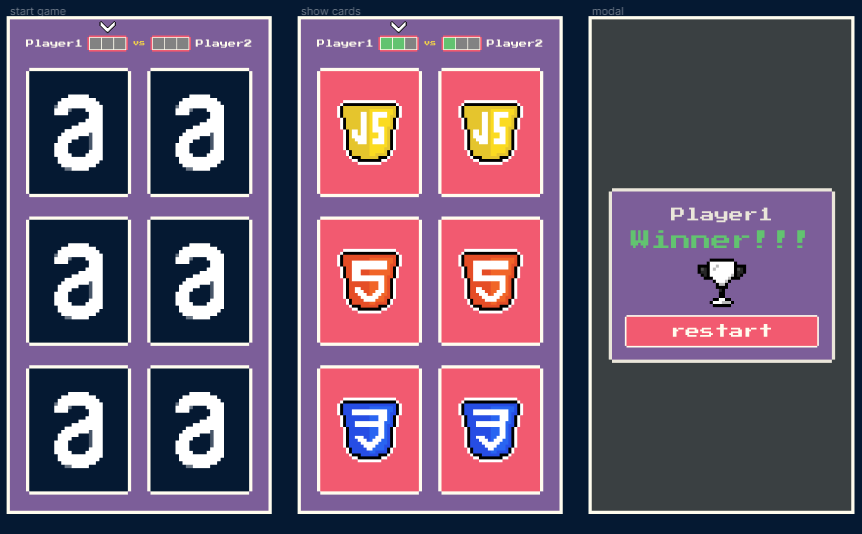

# 
MATCHING GAME

---
## 📚 Sobre
---

Matching Game é um jogo de memória construído a partir de componentes usando apenas vanilla javascript. Assim, simulando os react components do ReactJs.

O projeto está sendo desenvolvido durante o evento Js for React disponibilizado pelo Marco Bruno Dev.

 

---
## 💻 Tecnologias
---
 

- HTML
- CSS
- JavaScript
- ViteJs
- Github Hooks
- Gitmoji